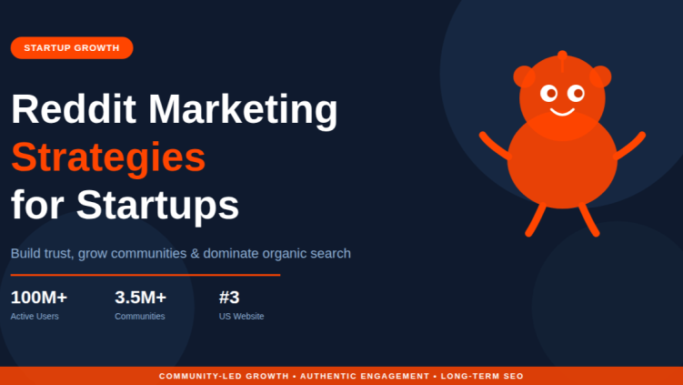

## Post 1

**Date:** 2026-05-26  
**URL:** https://www.linkedin.com/posts/ahsan-zahid-335629219_most-startups-fail-on-reddit-for-one-simple-activity-7464792206734729217-sKvP?utm_source=share&utm_medium=member_desktop&rcm=ACoAADmTDt8BDWmOLMsDU7QwDw9oszTNyrMMZVw

**Content:**

Most startups fail on Reddit for one simple reason:  
They try to sell before building trust.

Reddit is no longer just a discussion platform. It’s becoming a powerful channel for organic customer acquisition, startup brand awareness, and AI search visibility.

Startups that focus on authentic engagement instead of spam promotion are quietly building loyal communities and long-term growth.

In this article, I shared the best Reddit marketing strategies startups can use to grow organically in 2026 and beyond.

**Summary:**

In this post, Ahsan Zahid explains why trust-building is the foundation of successful Reddit marketing for startups. He highlights Reddit’s growing importance as a channel for organic acquisition, brand awareness, and AI-driven search visibility, emphasizing authentic engagement over direct selling.

---
