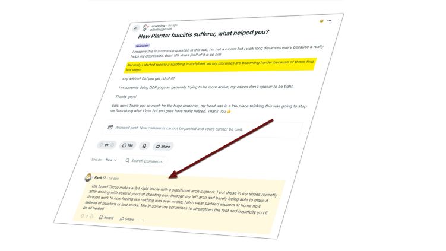

## Post 1

**Date:** 2026-06-10  
**URL:** https://www.linkedin.com/posts/annsmarty_the-best-part-of-reddit-that-not-many-experts-activity-7470485449371697153-S8CT?utm_source=share&utm_medium=member_desktop&rcm=ACoAADmTDt8BDWmOLMsDU7QwDw9oszTNyrMMZVw

**Content:**

The best part of Reddit that not many experts discuss: It works GREAT for audience insights, sentiment analysis, content brainstorming, and more! Here's how I use Reddit as a powerful intelligence!

**Summary:**

In this post, Ann Smarty highlights Reddit’s value beyond promotion by positioning it as a strong audience intelligence tool. She emphasizes how Reddit can help marketers uncover customer sentiment, identify recurring pain points, and generate content ideas based on authentic community conversations.

---
