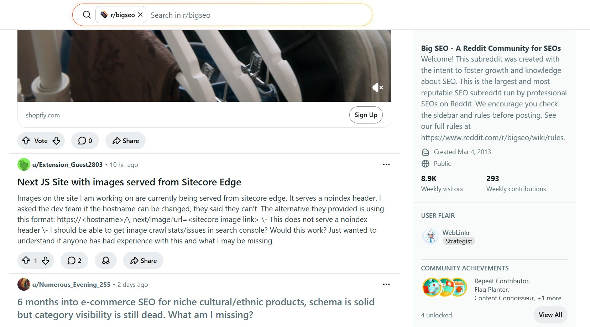

## Post 1

**Date:** 2026-06-12  
**URL:** https://www.linkedin.com/posts/davidquaid_heres-what-happens-when-reddit-mods-dont-activity-7471199238522126337-KoKk?utm_source=share&utm_medium=member_desktop&rcm=ACoAADmTDt8BDWmOLMsDU7QwDw9oszTNyrMMZVw

**Content:**

Here's what happens when Reddit mods dont do their jobs: the community dies.

This sub once had the 2nd or 3rd biggest membership for SEO on Reddit.

**Summary:**

In this post, David Quaid emphasizes the critical role of subreddit moderation in sustaining healthy and active communities. He highlights how poor moderation can reduce engagement, weaken trust, and eventually cause a community to lose relevance, making moderation a core factor in Reddit-based growth strategies.

---
