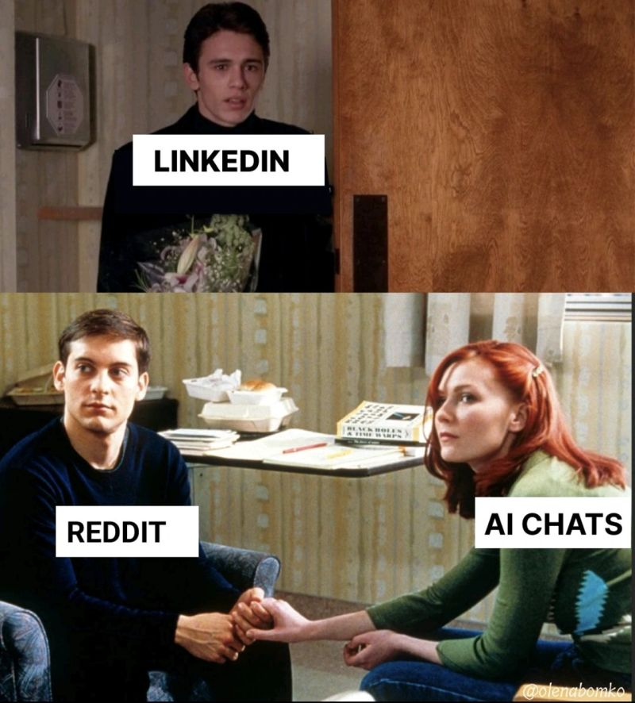

# Olena Bomko

## Post 1

**Date:** 2026-06-05  
**URL:** https://www.linkedin.com/posts/activity-7468649378958897152-9SA_?utm_source=share&utm_medium=member_desktop&rcm=ACoAADmTDt8BDWmOLMsDU7QwDw9oszTNyrMMZVw

**Content:**

Just read that Reddit is back at 1st place with 8.5% of all ChatGPT citations (Profound).

My best Reddit tips:

1. Optimize your profile (avatar, description, links).
2. List all your keywords (market category, use cases, features, competitors).
3. List all subreddits related to your industry. Join relevant subreddits.
4. Join building in public subreddits to share your story.
5. Do an AI visibility audit (manually or with tools). Find Reddit conversations as sources. Add valuable comments to the conversations (if they are still open). Do the same with niche conversations that already exist on Reddit.
6. Do social listening. Monitor brand mentions, industry terms, alternatives, and competitor mentions.
7. Check all the subreddits’ rules before publishing (even when you comment). Most subreddits prohibit promotions and links.
8. Promotional content can hurt your reputation. You can be banned.
9. Be specific, helpful, and transparent. Share your story, data, insights, tips, numbers, and experience. If you post/comment about your product (if a subreddit allows this), be transparent about your role.
10. Start with comments. Engage with the community.
11. If you want to mention your tool, make sure that you provide value in the first part of your comment.
12. If a subreddit prohibits promotions/links, do inbound marketing. Post valuable content about your industry, ask questions, and tell your story without links/brand names.
13. Pay attention to what works in each subreddit. Sort all the posts.
14. Mention your tool without links (if links are prohibited) but with context (category, ideal customer profile, benefits).
15. Use the 9:1 rule. For every 9 useful posts/comments, you can post 1 mention/link to your blog, tool, or channel.
16. Host Ask Me Anything sessions.
17. Create and grow your brand or niche community.
18. Don’t use tricks and hacks.

Join my community: r/MarketFit on Reddit.

**Summary:**

This post outlines Olena’s practical Reddit growth framework for improving visibility in AI search, building trust in niche communities, and avoiding common promotional mistakes. It emphasizes contribution-first marketing, social listening, and long-term community building over short-term hacks.

---
